# replot-network: Network charts for react
Intelligent and customizable network chart components for react.

## Installation
Only works with React projects. React must be installed separately.
```bash
npm install replot-network
```

Then with a module bundler like webpack/browserify that supports CommonJS/ES2015 modules, use as you would anything else.

```javascript
import {NetworkChart} from 'replot-network'
```

## API
replot-network is designed to create beautiful network charts right out of the box.
The only *required* input is properly formatted data.

### Basic Usage
In the simplest case, just supply data and specify the keys for parents and childs of links:

``` javascript
render() {
    let trades = [
      {exporter: "Germany", importer: "European Union", volume: 1468990},
      {exporter: "Netherlands", importer: "European Union", volume: 798744},
      {exporter: "European Union", importer: "France", volume: 745931},
      ...
    ]
    
    return(
        <NetworkChart 
            data={trades}
            parentKey="exporter"
            childKey="importer"
        />
    )
}
```
- `data` is the only required props
- `parentKey` defaults to `"parent"`
- `childKey` defaults to `"child"`


### Dimensions
Dimensions may be specified by passing in `width` and `height` props with numbers, in the unit of pixels.

```javascript
render() {
  return(
    <NetworkChart
        data={trades} parentKey="exporter" childKey="importer"
        width={600}
        height={450} 
    />
  )
}
```
- `width` defaults to `800`
- `height` defaults to `600`

Width dimensions may also be specified with a string, as a percentage. The width
will then be calculated as a proportion of the parent container.

```javascript
render() {
  return(
    <NetworkChart 
        data={trades} parentKey="exporter" childKey="importer"
        width="50%"
        height={450} 
    />
  )
}
```

 Default                   | width={600} height={450}  | width="50%" height={450}        
:-------------------------:|:-------------------------:|:-------------------------:
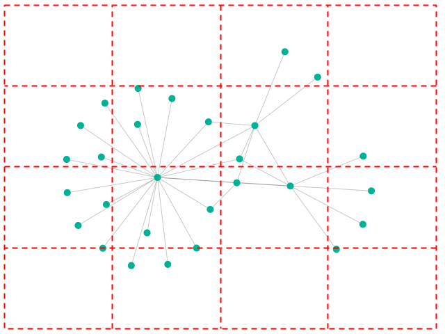 | 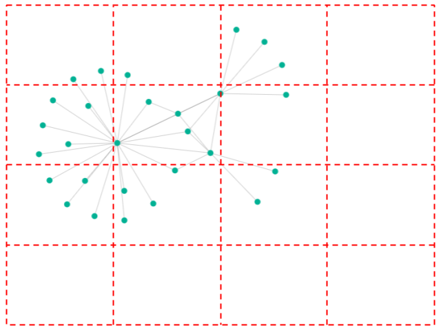 | 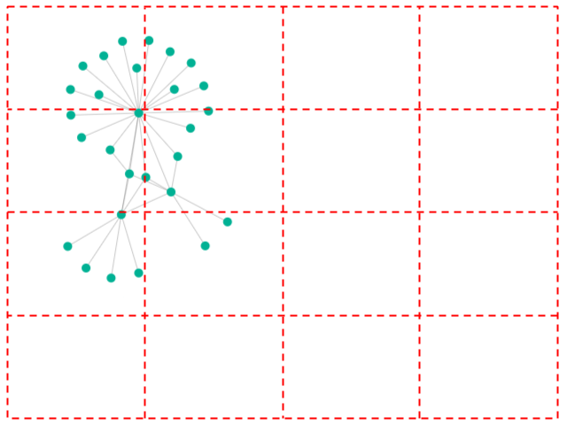

### Link Styles
#### Link Color
Link color may be specified by passing in `lineColor` prop with a hex string.

```javascript
render() {
  return(
    <NetworkChart 
        data={trades} parentKey="exporter" childKey="importer"
        lineColor="#52b3d9"
    />
  )
}
```
- `lineColor` defaults to `"#1b1b1b"`

#### Link Opacity
Link opacity may be specified by passing in `lineOpacity` prop with a number between 0 to 1.

```javascript
render() {
  return(
    <NetworkChart 
        data={trades} parentKey="exporter" childKey="importer"
        lineOpacity={1}
    />
  )
}
```
- `lineOpacity` defaults to `0.25`

#### Link Width
Link width may be specified by passing in `lineWidth` prop with a number in the unit of pixels.

```javascript
render() {
  return(
    <NetworkChart 
        data={trades} parentKey="exporter" childKey="importer"
        lineWidth={5}
    />
  )
}
```
- `lineWidth` defaults to `1`

lineColor="#52b3d9"        | lineOpacity={1}           | lineWidth={5}        
:-------------------------:|:-------------------------:|:-------------------------:
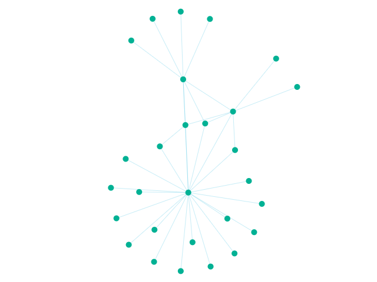 | 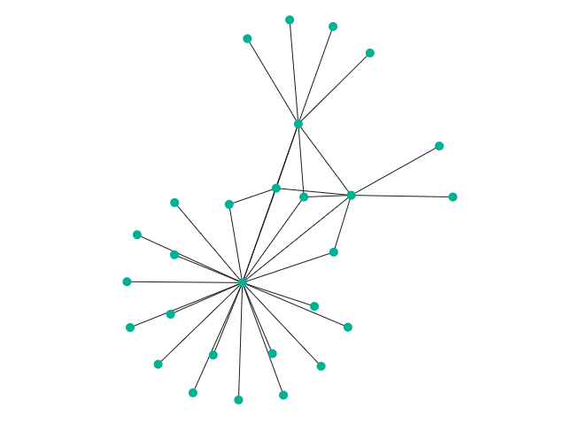 | 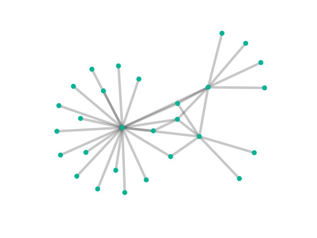

### Weighted Links
Link width may be weighted by setting the `weightedLinks` prop to `true`. Optionally, supply the `linkKey` prop with the key of link weights and/or to the `maxWidth` prop with the maximum link width in the unit of pixels.

Weighted link widths will range between `lineWidth` and `maxWidth`.

```javascript
render() {
  let nodes = [
    {region: "America", country: "Canada", exports: 402400},
    {region: "Europe", country: "Belgium", exports: 250800},
    {region: "Asia", country: "China", exports: 2011000},
    ...
  ]
  
  return(
    <NetworkChart 
        data={trades} nodes={nodes} parentKey="exporter" childKey="importer"
        weightedLinks={true}
        linkKey="volume"
        maxWidth={15}
    />
  )
}
```
- `weightedLinks` defaults to `false`
- `linkKey` defaults to `null`
- `maxWidth` defaults to `10`

If `weightedLinks` is `true`, but no `linkKey` is supplied, link width is weighted by how many times the same link appears in data.

 Default                   | linkKey="volume" | linkKey="volume" maxWidth={15}       
:-------------------------:|:-------------------------:|:-------------------------:
 | 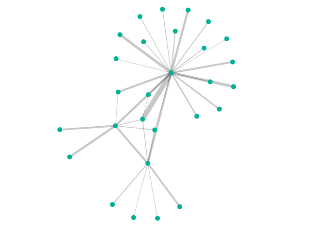 | 

### Node Color
Node color may be specified through 2 different mechanisms, both through a `color` prop.
If none of the mechanisms are specified, NetworkChart defaults to a built-in
color palette.

#### Group Color
Users can supply the `nodes`, `nodeKey`, and `groupKey` props to color nodes by groups. `nodeKey` is the key of node IDs and `groupKey` is the key of node groups.

```
render() {
  let nodes = [
    {region: "America", country: "Canada", exports: 402400},
    {region: "Europe", country: "Belgium", exports: 250800},
    {region: "Asia", country: "China", exports: 2011000},
    ...
  ]
  
  return(
    <NetworkChart 
        data={trades} parentKey="exporter" childKey="importer"
        nodes={nodes}
        nodeKey="country"
        groupKey="region"
    />
  )
}
```
- `nodes` defaults to `null`
- `nodeKey` defaults to `id`
- `groupKey` defaults to `null`

Default | groupKey="region"    
:-------------------------:|:-------------------------:
 | 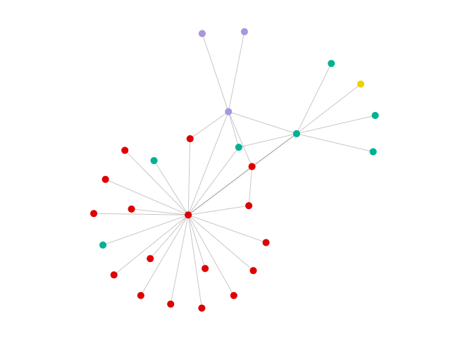

#### User-provided Color Palette
Users can specify a list of colors to use as a palette, passed to the `color` prop.

```javascript
render() {
  let colors = [
    "#fea9ac", "#fc858f", "#f46b72", "#de836e",
    "#caa56f", "#adcc6f", "#8ebc57", "#799b3f"
  ]

  return(
    <NetworkChart 
        data={trades} parentKey="exporter" childKey="importer"
        nodes={nodes} nodeKey="country" groupKey="region"
        color={colors}
    />
  )
}
```

color={colors} | color={colors} groupKey="region"    
:-------------------------:|:-------------------------:
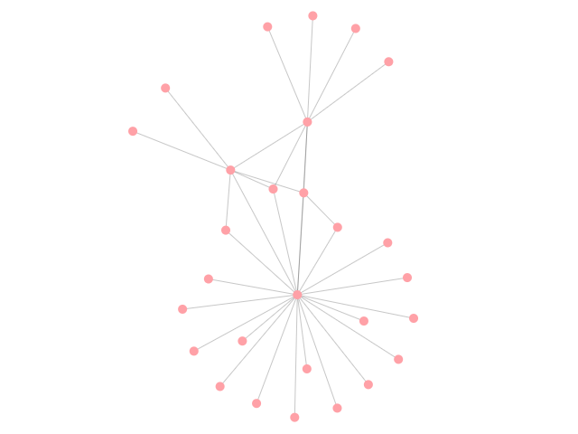 | 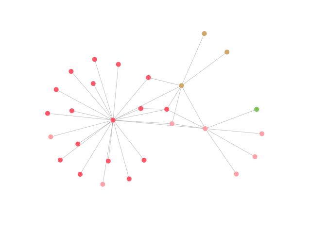

#### User-provided Color Function
Users can also specify a function to assign colors to different data series. Expected arguments to the function is the data of node.

```javascript
colorMe(data) {
  if (data.region === "Europe"){
    return "green"
  } else {
    return "blue"
  }
}

render() {
  return(
    <NetworkChart 
        data={trades} parentKey="exporter" childKey="importer"
        nodes={nodes} nodeKey="country"
        color={this.colorMe}
    />
  )
}
```

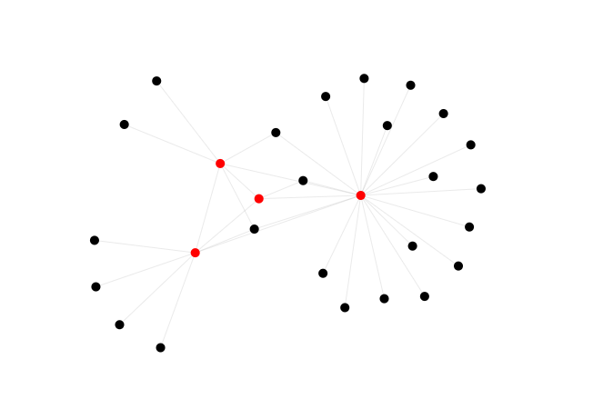

### Node Radius
Node radius may be specified by passing in `nodeRadius` prop with a number in the unit of pixels.

```javascript
render() {
  return(
    <NetworkChart 
        data={trades} parentKey="exporter" childKey="importer"
        nodeRadius={10}
    />
  )
}
```
- `nodeRadius` defaults to `5`

 Default                   | nodeRadius={10}         
:-------------------------:|:-------------------------:
 | 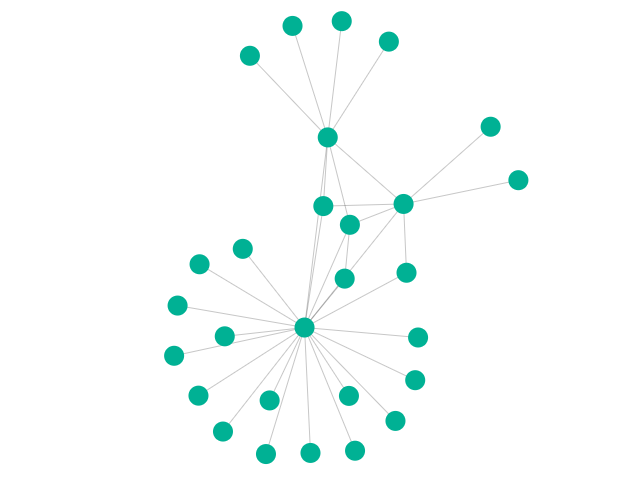

### Weighted Nodes
Node radius may be weighted by supplying `nodes`, `nodeKey`, and `nodeWeightKey` props. `nodeKey` is the key of node IDs and `nodeWeightKey` is the key of node weights. 

Optionally, supply the `maxRadius` prop with the maximum node radius in the unit of pixels. Weighted node radius will range between `nodeRadius` and `maxRadius`.

```javascript
render() {
  let nodes = [
    {region: "America", country: "Canada", exports: 402400},
    {region: "Europe", country: "Belgium", exports: 250800},
    {region: "Asia", country: "China", exports: 2011000},
    ...
  ]

  return(
    <NetworkChart 
        data={trades} parentKey="exporter" childKey="importer"
        nodes={nodes}
        nodeKey="country"
        nodeWeightKey="exports"
        maxRadius={20}
    />
  )
}
```
- `nodes` defaults to `null`
- `nodeKey` defaults to `id`
- `nodeWeightKey` defaults to `null`
- `maxRadius` defaults to `10`

 Default                   | nodeWeightKey="exports"   | nodeWeightKey="exports" maxWidth={20}
:-------------------------:|:-------------------------:|:-------------------------:
 | 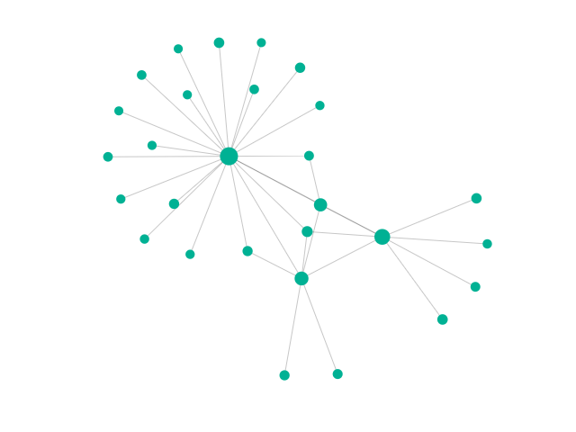 | 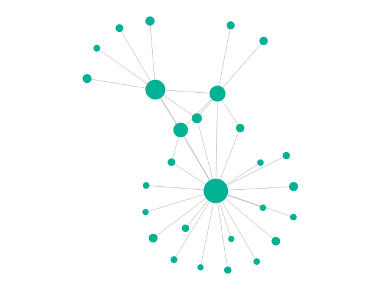

### Node Labels
Node labels may be switched on by setting the `showLabels` prop to `true`.

```javascript
render() {
  return(
    <NetworkChart 
        data={trades} parentKey="exporter" childKey="importer"
        showLabels={true}
    />
  )
}
```
- `showLabels` defaults to `false`, `true` displays the labels

Node labels display their IDs by default when switched on.

#### Node Label Color
Node label color may be specified by passing in `labelColor` prop with a hex string.

```javascript
render() {
  return(
    <NetworkChart 
        data={trades} parentKey="exporter" childKey="importer"
        showLabels={true}
        labelColor="#52b3d9"
    />
  )
}
```
- `labelColor` defaults to `"#1b1b1b"`

showLabels={true} | showLabels={true} labelColor="#52b3d9"    
:-------------------------:|:-------------------------:
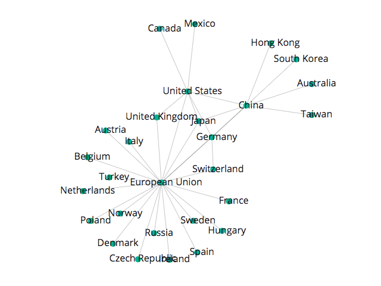 | 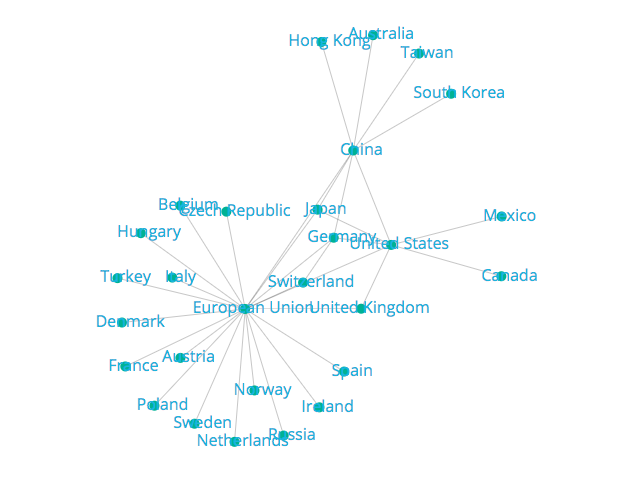

Optionally, supply the the `nodes`, `nodeKey`, and `labelKey` props to specify the label contents. `nodeKey` is the key of node IDs and `groupKey` is the key of node labels.

```
render() {
  let nodes = [
    {region: "America", country: "Canada", exports: 402400},
    {region: "Europe", country: "Belgium", exports: 250800},
    {region: "Asia", country: "China", exports: 2011000},
    ...
  ]

  return(
    <NetworkChart 
        data={trades} parentKey="exporter" childKey="importer"
        showLabels={true}
        nodes={nodes}
        nodeKey="country"
        labelKey="region"
    />
  )
}
```
- `nodes` defaults to `null`
- `nodeKey` defaults to `id`
- `labelKey` defaults to `null`

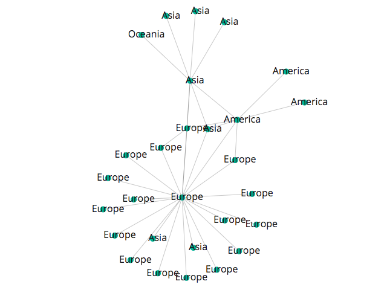

### Attraction Factor
Density of nodes may be specified by passing in `attractionFactor` prop with a number.

```javascript
render() {
  return(
    <NetworkChart 
        data={trades} parentKey="exporter" childKey="importer"
        attractionFactor={5}
    />
  )
}
```
- `attractionFactor` defaults to `1`

 Default                   | attractionFactors={5}         
:-------------------------:|:-------------------------:
 | 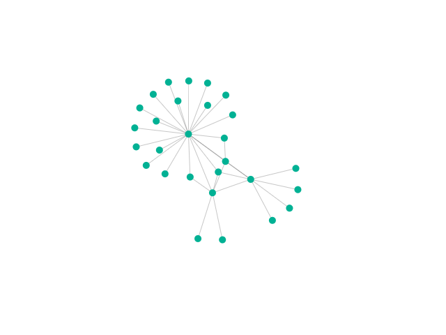

### Tooltip
Tooltips can display more specific information about a data series.

```javascript
render() {
  return(
    <NetworkChart 
        data={trades} parentKey="exporter" childKey="importer"
        tooltip={true}
        tooltipColor="light"
    />
  )
}
```
- `tooltip` defaults to `true`, `false` turns the tooltip off
- `tooltipColor` defaults to `light`, it can be set to `light` or `dark`
- `tooltipContents` defaults to data associated with the node (ID, group and weight if applicable)

Default (tooltipColor="light")|tooltipColor="dark"|tooltip={false}   
:-------------------------:|:-------------------------:|:-------------------------:
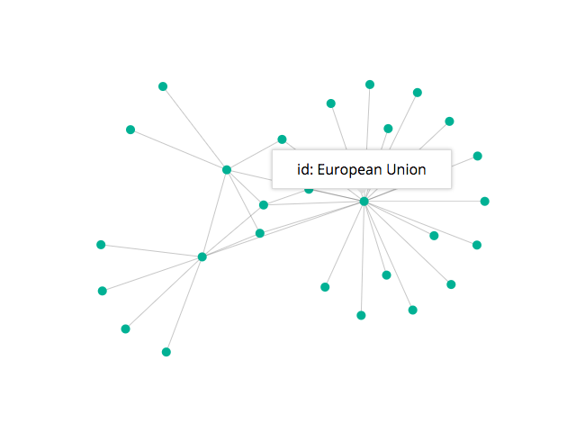 | 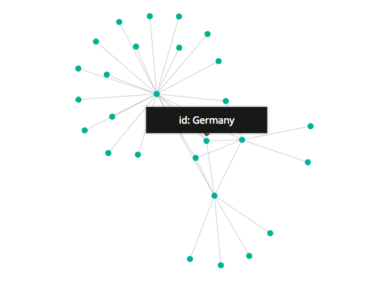 | 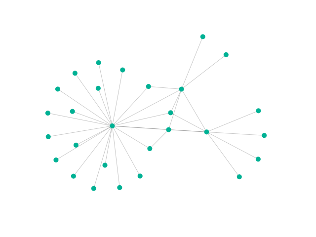

#### User-provided Tooltip Function
Users can customize what is displayed inside the tooltip with a function. Expected arguments to the function are the title of the location and the data for the specific location hovered over. The function should return JSX.

```javascript
fillTooltip(data){
  return(
    <div>
      <span>The data for this node looks like: {JSON.stringify(data)}</span>
    </div>
  )
}

render() {
  return(
    <NetworkChart 
        data={trades} parentKey="exporter" childKey="importer"
        tooltipContents={this.fillTooltip}
    />
  )
}
```

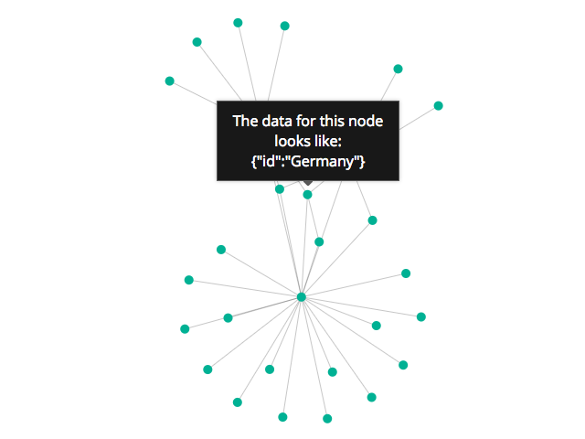
